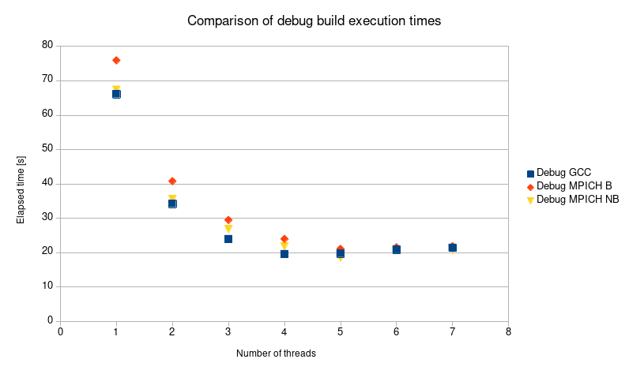
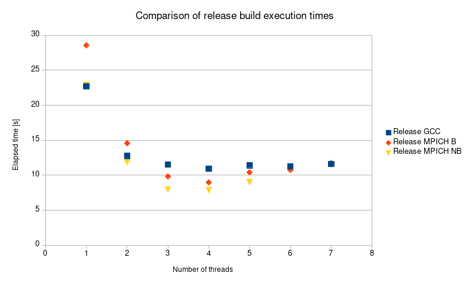

---
---

# **The producer and consumers scheme using MPI**

## 0. Given tasks

1. Port the producer-consumers program created using threads to the MPI environment. You may use only the point-to-point routines (with MPI_Recv() receiving MPI_ANY_SOURCE) or other routines as well. However, first use only blocking routines, if the scheme works correctly try to increase parallelism by employing non-blocking routines.

2. Check what is the dependence of the speed of retrieving tables from the queue by consumers depending on number of created Consumer processes and compare these results to the results obtained for C++ threads.

## 1. Information about hardware
### 1.1. Host operating system
1. Processor:
 * Intel Core i7-9850H
 * Clock Rate - 2.60 GHz
 * Number of physical cores - 6
 * Number of logical processors - 12
2. RAM: 16 GB

### 1.2. Guest operating system
1. Processor:
 * Number of processors - 2
 * Number of cores per processor - 4
2. RAM: 8 GB

## 2. Information about software
### 2.1. Host operating system
1. Operating system: Microsoft Windows 10 Enterprise
2. Virtualization: VMware Workstation 15.5 Pro

### 2.2. Guest operating system
1. Operating system: Manjaro (kernel version 5.6.12)
2. Project type: CMake (version 3.17.2)
3. Toolchain: GNU GCC (version 9.3.0)
4. Build: ```cmake --build . --target all -- -j 8```
5. IDE: CLion
6. MPI distribution: mpich 3.3.2
```
sudo pacman -S yay
yay -S mpich
```

## 3. Source code
Source code of implemented MPICH wrapper is available [there](https://github.com/SzymonZos/Scientific-Computing/tree/master/MPI).
Project using non-blocking routines can be found [there](https://github.com/SzymonZos/Scientific-Computing/tree/master/ProducerConsumer/Mpi). There is no explicit code to call blocking ones. However this task can be achieved by checking out commit 7212376f19b6ddb890c34a52016c7986b02f3861.

Features:

* Wrapped ugly and unnecessary C API to modern C++ interface.
* Non-blocking routines employed to execute given task.
* Internal queue created as circular buffer in Producer class.
* Same Consumer and Producer interfaces as in threads' task.

## 4. Input values

* Number of elements produced by producer = 4000
* Number of random numbers in each element = 100'000

1. Demo
* Number of processes = 8

2. Comparison
* Number of processes = 1-8 (due to implementation limit)

## 5. Possible output
Due to a **huge** amount of logs possible output is limited to demo version:
```
2) Mean: -57.2095
1) Mean: -198.735
6) Mean: -37.0974
5) Mean: 123.545
3) Mean: 1.42055
7) Mean: -31.8428
2) Mean: -26.389
4) Mean: 140.891
6) Mean: 98.6198
5) Mean: 70.0186
1) Mean: 31.7398
7) Mean: 0.43274
2) Mean: -32.0001
```

## 6. Comparison

|**Threads**|**Debug GCC**|**Debug MPICH B**|**Debug MPICH NB**|
|:---------:|:-----------:|:---------------:|:----------------:|
|   **1**   |    66.144   |      75.951     |      67.415      |
|   **2**   |    34.232   |      40.81      |      35.573      |
|   **3**   |    23.973   |      29.512     |      26.845      |
|   **4**   |    19.602   |      24.006     |      21.84       |
|   **5**   |    19.765   |      21.112     |      18.584      |
|   **6**   |    20.868   |      21.579     |      20.743      |
|   **7**   |    21.43    |      21.885     |      20.785      |



|**Threads**|**Release GCC**|**Release MPICH B**|**Release MPICH NB**|
|:---------:|:-------------:|:-----------------:|:------------------:|
|   **1**   |     22.707    |       28.547      |       22.931       |
|   **2**   |     12.759    |       14.561      |       11.848       |
|   **3**   |     11.521    |       9.823       |        7.971       |
|   **4**   |     10.938    |       8.966       |        7.888       |
|   **5**   |     11.405    |       10.399      |        9.016       |
|   **6**   |     11.267    |       10.755      |        10.72       |
|   **7**   |     11.603    |       11.728      |       11.424       |



## 7. Comments and conclusions
* Multi threading comes in handy under these particular constraints provided in discussed task.
* Single thread is way worse than other multiple ones.
* Execution in release build is usually ~2, up to ~3, times faster than debug one.
* Significantly greater number of threads than number of physical cores results in slower execution. Usually the best times are achieved with slightly greater number of threads than number of physical cores thanks to context switching between same core.
* In the debug build blocking implementation using Message Passing Interface is underperforming compared to non-blocking one and standard C++ threads. However, in the release build the peak time for MPI is much lower than threads one.
