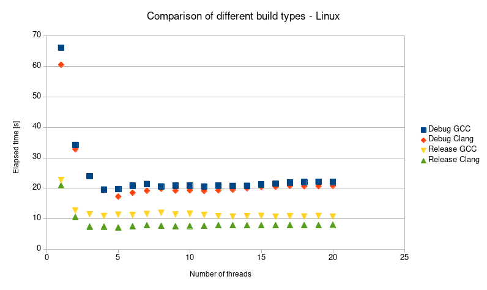

---
---

# **The producer and consumers scheme**

## 0. Given tasks

1. Requirements
  * Create a Queue class representing a FIFO queue of length limited to the value passed as a constructor parameter, whose elements are integer arrays of size 100000. As an element of the Queue use std::array<>.
  * Create the Producer class, which produces tables of size 100000 random integers and inserts them into the queue described in point 1 (pointer to the queue and number of arrays to be produced passed as the argument of the constructor).
  * Create a Consumer class that takes tables from the queue (pointer to the queue passed as constructor argument) and sorts them (sorts a single table, outputs its checksum, discards it and then takes the next one).
  * Producer and Consumer should yield() if the Queue is full or empty, respectively. Ensure that the cooperating threads properly finish their jobs and destruct (no produced table may be discarded prior to being sorted, Queue may be destructed only if it is empty and all the consumers and producers attached to it are destructed). At the end, each consumer should report how many tables it sorted.


2. Main task

  Create: 1 Queue thread, 1 Producer thread, and several Consumer threads. The capacity of the queue must be many times bigger than the maximum number of Consumer threads planned to be created during experiments; the number of tables to be produced by the Producer thread must be many times bigger than the queue capacity. Check what is the dependence of the speed of retrieving tables from the queue by consumers depending on number of created Consumers threads. Check if it is beneficial to create a number of threads greater or significantly greater than thread::hardware_concurrency() or greater than the number of physical cores in the CPU?

## 1. Information about hardware
### 1.1. Host operating system
1. Processor:
 * Intel Core i7-9850H
 * Clock Rate - 2.60 GHz
 * Number of physical cores - 6
 * Number of logical processors - 12
2. RAM: 16 GB

### 1.2. Guest operating system
1. Processor:
 * Number of processors - 2
 * Number of cores per processor - 4
2. RAM: 8 GB

## 2. Information about software
### 2.1. Host operating system
1. Operating system: Microsoft Windows 10 Enterprise
2. Virtualization: VMware Workstation 15.5 Pro

### 2.2. Guest operating system
1. Operating system: Manjaro (kernel version 5.6.5)
2. Project type: CMake (version 3.17.1)
3. Toolchain: GNU GCC (version 9.3.0), Clang (version 9.0.1)
4. Build: make \-\- -j 8
5. IDE: CLion

## 3. Source code
Source code is available [there](https://github.com/SzymonZos/Scientific-Computing/tree/master/ProducerConsumerThreads).

Features:

* Split declaration and definition of template classes to increase readability.
* Wrapped std::queue as Queue class member to eliminate error-prone implementations.
* Implementation of Producer and Consumer class with use of RAII.
* Encapsulated and coupled std::thread with each instance of Producer / Consumer class.
* RAII style Timer with optional logging to the file.
* Ready to be unit and integration tested thanks to interfaces.
* Usage of exceptions, STL algorithms and smart pointers.

Future improvements:

* Conditional variables and unique locks.

## 4. Input values
1. Demo

* Size of the Queue = 200
* Number of elements produced by producer = 4000
* Number of random numbers in each element = 100'000
* Number of consumers = 8

2. Comparison

* Size of the Queue = 200
* Number of elements produced by producer = 4000
* Number of random numbers in each element = 100'000
* Number of consumers = 1-20

## 4. Possible output
Due to a **huge** amount of logs possible output is limited to demo version:
```
...
139951292159744: 92.0344
139951258588928: 13.405
139951165400832: 7.24918
139951283767040: -6.28011
139951275374336: 17.795
139951173793536: -70.2016
139951266981632: 53.0891
139951165400832: -55.9684
139951292159744: 42.2148
139951275374336: 60.3759
139951258588928: -63.4853
139951283767040: -106.472
139951173793536: -137.511
139951292159744: 28.383
139951275374336: -19.2777
139951266981632: -48.24
Sorted: 139951275374336: 492
Sorted: 139951266981632: 496
139951250196224: -16.4144
Sorted: 139951250196224: 497
Sorted: 139951283767040: 519
139951173793536: 29.9345
Sorted: 139951173793536: 502
139951165400832: 172.51
Sorted: 139951165400832: 492
139951258588928: -0.37567
Sorted: 139951258588928: 503
139951292159744: 41.9893
Sorted: 139951292159744: 499
Elapsed time: 18.307 s  

Process finished with exit code 0
```

## 5. Measured time in seconds
1. Linux

|**Threads**|**Debug GCC**|**Debug Clang**|**Release GCC**|**Release Clang**|
|:---------:|:-----------:|:-------------:|:-------------:|:---------------:|
|   **1**   |    66.144   |     60.559    |     22.707    |      20.971     |
|   **2**   |    34.232   |     32.839    |     12.759    |      10.584     |
|   **3**   |    23.973   |     24.038    |     11.521    |      7.46       |
|   **4**   |    19.602   |     19.402    |     10.938    |      7.46       |
|   **5**   |    19.765   |     17.292    |     11.405    |      7.177      |
|   **6**   |    20.868   |     18.551    |     11.267    |      7.555      |
|   **7**   |    21.43    |     19.207    |     11.603    |      7.895      |
|   **8**   |    20.63    |     19.887    |     11.998    |      7.702      |
|   **9**   |    20.864   |     19.262    |     11.44     |      7.567      |
|   **10**  |    20.9     |     19.347    |     11.63     |      7.66       |
|   **11**  |    20.612   |     19.125    |     11.299    |      7.694      |
|   **12**  |    20.91    |     19.338    |     10.859    |      7.925      |
|   **13**  |    20.801   |     19.549    |     10.763    |      7.899      |
|   **14**  |    20.834   |     20.012    |     10.894    |      7.896      |
|   **15**  |    21.243   |     20.463    |     10.982    |      7.888      |
|   **16**  |    21.538   |     20.513    |     10.687    |      7.925      |
|   **17**  |    21.924   |     20.802    |     10.817    |      7.948      |
|   **18**  |    22.056   |     20.675    |     10.785    |      7.957      |
|   **19**  |    22.153   |     20.707    |     10.962    |      7.93       |
|   **20**  |    22.084   |     20.812    |     10.738    |      8.065      |

2. Windows
```
TODO
```

## 6. Charts



## 7. Comments and conclusions
* Multi threading comes in handy under these particular constraints provided in discussed task.
* Single thread is way worse than other multiple ones.
* Execution in release build is usually ~2 times faster than debug one.
* For debug and clang release builds increasing number of consumers above std::thread::hardware_concurrency() results in slower execution.
* Some weird optimization occurs under gcc release build resulting in faster execution.
* Conditional variables could be used in favor of some parts of exception handling.
* clang > gcc


